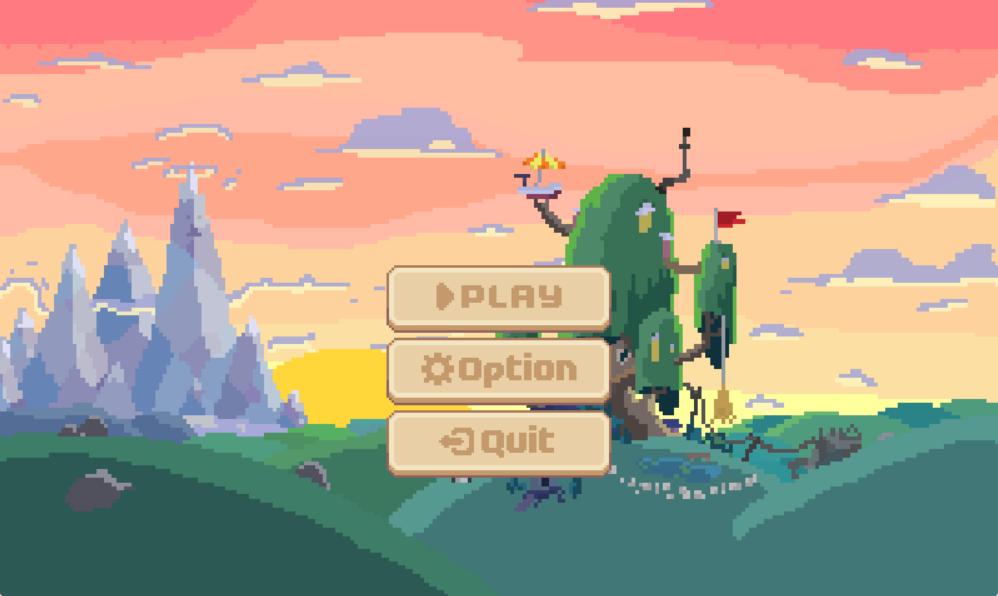
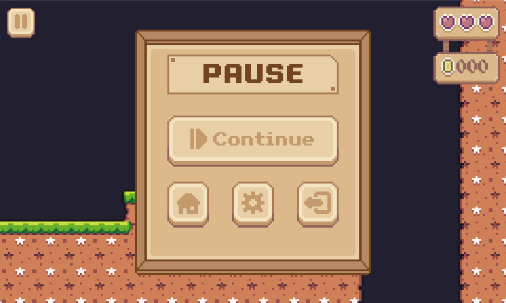

# My Adventure

## Ngôn ngữ: C++, SDL
## Cách tải và chạy game
    C1: Cài git và clone repo về máy
    C2: Nhấn vào phím Code và chọn Download ZIP

    + Chạy file MyAdventure.exe
## Giới thiệu game
    + Tham khảo game My Adventure: Platformer trên nền tảng điện thoại di động
    + Cách chơi: 
        Mục tiêu của trò chơi vượt các chướng ngại vật, đánh bại các con quái vật, ăn trái cây trên đường đi để kiếm điểm và cố gắng hoàn thành trong thời gian nhanh nhất cũng như tìm được hết các phòng bí mật để kiếm thật nhiều điểm

        Di chuyển bằng các phím điều hướng hoặc phím WASD. Nhân vật có thể bám lên tường để trèo lên các chỗ cao, khó với tới cũng như khéo léo vượt qua chướng ngại vật.

    + Phím tắt:
        
        + Phím A / mũi tên trái: di chuyển sang trái.
        + Phím D / mũi tên phải: di chuyển sang phải.
        + Phím A / mũi tên lên: nhảy

## Cấu trúc code
    
    + Các file header là để khai báo các thông số cũng như các hàm cần dùng.
    + Các file *.cpp là để viết code thực thi các hàm.
    + Folder SDL chứa những file cần dùng của thư viện SDL.
    + Folder assets chứa tài nguyên của game như: hình ảnh, âm thanh, font,...
    + Folder data chứa dữ liệu game như: map, tileset,...

    + File MyAdventure.cpp sẽ chạy khai báo ban đầu (kiểm tra thư viện có hoạt động hay không) và chạy vòng lập game.
    + File Game.cpp sẽ chứa các hàm khởi tạo cửa sổ như tạo window, renderer, event và để nhận các sự kiện người dùng.
    + Các file *.cpp tương ứng với các file *.hpp sẽ là phần khai báo cho các class cần dùng.

    + Có sử dụng các thư viện ngoài là Tileson dùng để thao tác với dữ liệu của map.
    + Các map của trò chơi được tạo từ phần mềm Tiled và các spritesheet là từ phần mềm Aseprite.